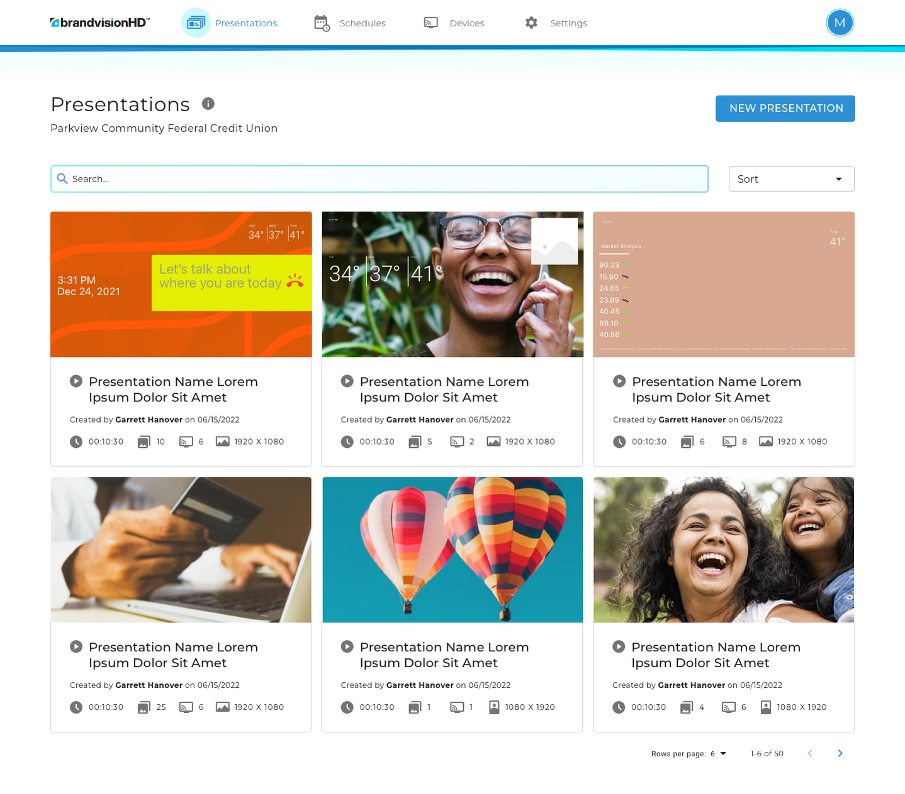
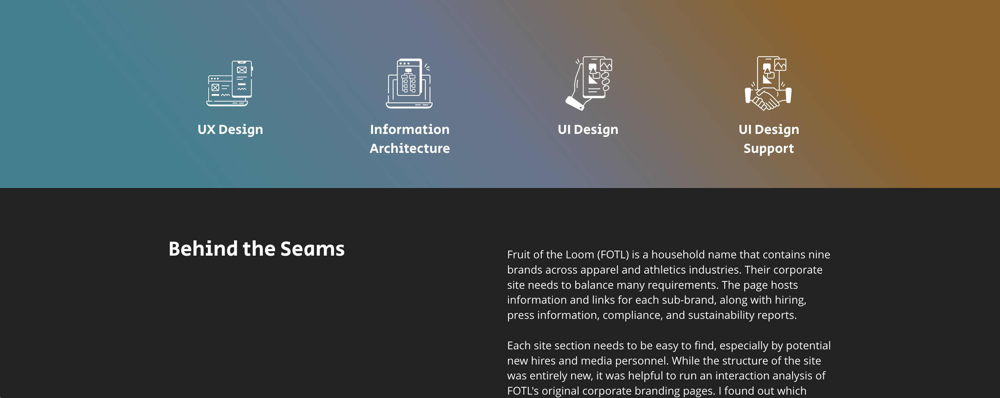

Around the time I started working on my own portfolio website, I was talking to my friend Aaron about his goal to find a new job in the UK. He was stuck at the part where he had to write about his own work.

Aaron has been working on ambitious UX and UI design projects for as long as I've known him, but we'd never really gotten too deep into them because, despite my interest in all the details, they've always come up during big group/family interactions where it would alienate everyone if I started asking about user-testing or font hierarchies.  
This was _perfect_!!

Aaron and I set aside time for me to interview him about five major projects, and he talked freely about the accomplishments and struggles without worrying how it would all sound in prose.

I mostly write stories, so I went over my notes and came up with a kind of "storyline" or set of "beats" (that's what my dad calls them) for each project. When Aaron was happy with the focus of each one, I researched the clients as much as I could and filled out the case studies with prose cut together from our interviews.

Aaron had picked projects with unique aims so I had a lot of questions about how he approached each one: How did he streamline an app for scheduling what gets shown on hundreds of bank kiosks? How does he design within the constraints of an established brand like Fruit of the Loom or UCLA? What are the nuances of building touchscreen controls for a robot pilot!??? He said it was like Breath of the Wild!!

What a treat to be able to ask all the questions I wanted about a friend's cool jobs.
