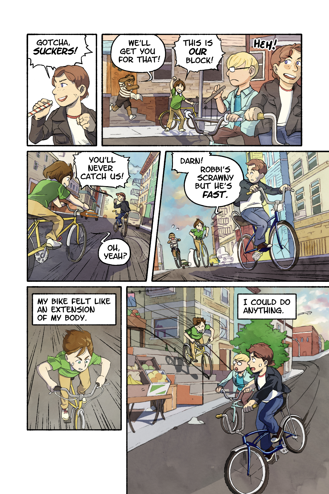

In 2022 my friend Hazel Newlevant asked me about putting together a story for a possible comic anthology: It's like a kids book with cool, real-life role models that are all trans!

You can get the book [here](https://bookshop.org/p/books/becoming-who-we-are-real-stories-about-growing-up-trans-lilah-sturges/20718710?ean=9781949518269).

When I came out in 2009 there were, I think, 2 books that included trans people in the St. Paul bookstore with the LGBTQ section (it would have been called a "gay and lesbian" or "sexuality" section at the time). The books were dense, adult, and focused almost entirely on the details of transition. Where were the cool trans people out in the world for me to look up to?

Hopefully, this is something people have to ask less and less. I hope this book is a part of that.

![3 comic panels with forest ranger Robbi Mecus as a child climbing in apartment building in Brooklyn, NY. Panel 1. Caption: I loved the feel of my body in motion... Robby is shown close up and from behind, climbing up windowsills and air-conditioning units. Her hand is reaching up out of the frame, almost as if she's climbing up to a higher point in the comic. Panel 2. Robbi is in the foreground with one hand on a windowsill and the other grasping a metal ladder going high above the streets. She's looking down at a now tiny friend, as he calls up to her: "You're crazy! I'm going home!" Panel 3. Caption: ...The effort of overcoming my fears. Robbi is vaulting over a thin metal railing at the end of her climb.](comic_greenpoint-climb.png)

"Becoming Who We Are" is a comic anthology featuring 9 stories about different trans people who have done and are doing amazing things in the world. Each story is also drawn by a different trans comic artist! I drew a story about **Robbi Mecus**. Robbi is a rock/ice climbing forest ranger who rescues people in areas like the Adirondak mountains.

The story, which was written by the great Lilah Sturges and project director Ana Joanes, focuses on her upbringing and discovery of her athletecism and rock climbing.
I got to do a lot of research and learn a lot about Robbi to make this comic. Ana had started with a lengthy video interview, and there are fortunately quite a few articles from and about Robbi online. If you haven't heard it, I was really inspired by [this interview of her on NPR](https://www.northcountrypublicradio.org/news/story/43054/20210118/wild-side-how-a-trans-forest-ranger-found-herself-in-the-adirondacks) (urr, wait till after you read the book!!).

The initial scene is a bike-chase through the streets of Greenpoint Brooklyn in the 1970s. To figure out the composition (and architecture) for each panels in this scene, I built a mini 3D scene using older buildings from the area.

I had never drawn rock-climbing before, and didn't even know what the equipment looked like. I went and tried it at a local gym, and I've continued to go every so often 💕 Rock climbing has changed a lot since the 80's - I made sure to research what kind of equipment, clothing, and rock-climbing shoes would have been used when Robbi was just starting to try climbing.

There was a lot to include in each page. I really liked drawing the dynamic poses of Robbi climbing. One of my favorite parts was going wild in the forest scenery, seeing her hike into the dappled light.

Being part of this project felt healing. Thank you Hazel and Ana.

  

### Update, content warning for loss and grief:

::: spoiler
Shortly after I drafted this page, Robbi Mecus died at the end of April, 2024. I didn't get to meet Robbi while working on the comic. I felt connected to her through interviews, pouring over photos and connecting to her growth through my own experience, and had dreamed of getting to meet her in the Adirondacks for a hike one day. To be able to tell her how her story made me feel, and got me to try rock climbing.

I'm so sorry to all of Robbi's family. Her companions, and the queer climbers she mentored and inspired directly to be themselves. One thing that many articles noted after Robbi died was how active she was to smash the boundaries around gender and queerness in climbing, to guide other queer people up into the mountains just as they are.

From the interview above, [re-published in this article](https://www.npr.org/2024/05/03/1249036607/robbi-mecus-a-superhero-of-outdoors-and-lgbtq-communities-in-the-adirondacks-die).

> There's many reasons why I didn't come out until I was 44. But one of them was because I didn't see anybody else doing the things that I still wanted to do, and I didn't think I could do them. I didn't see any queer rangers. I didn't see any trans climbers. - Robbi Mecus

Robbi lived as this role model. I hope the book can introduce Robbi to anyone who might be looking for her, and more.
:::
