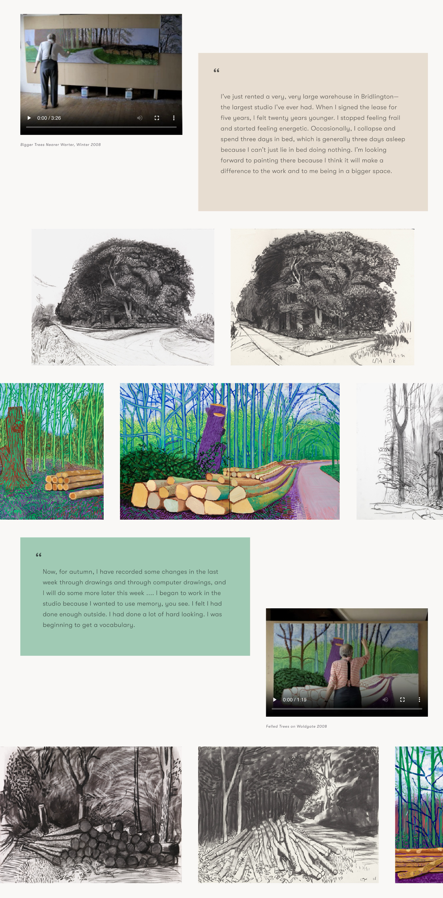
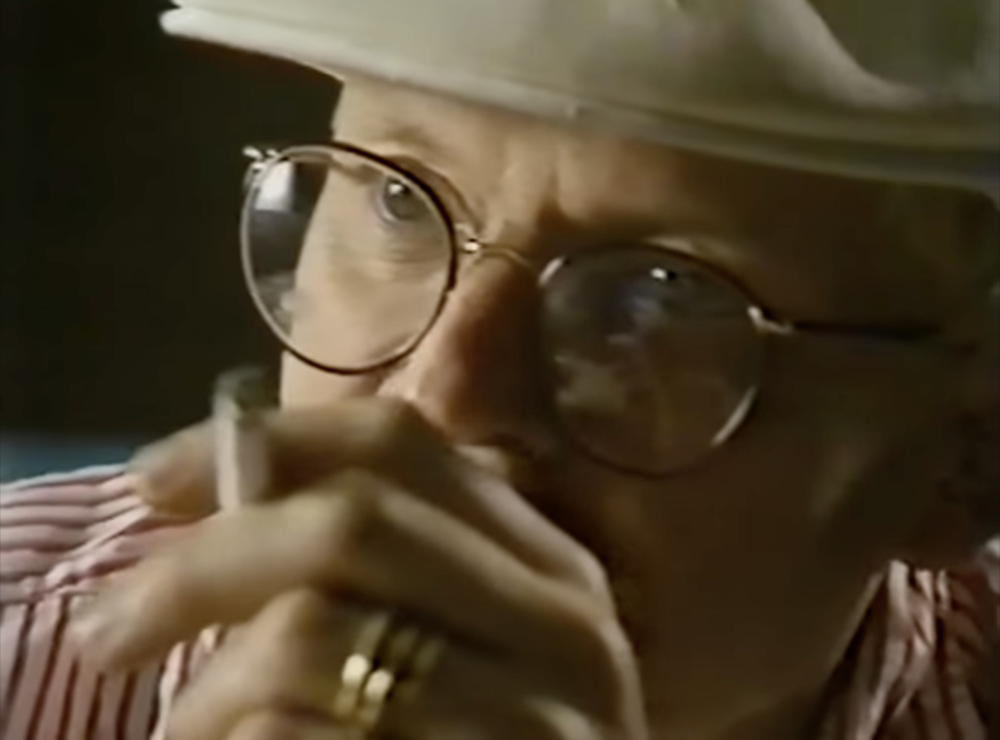
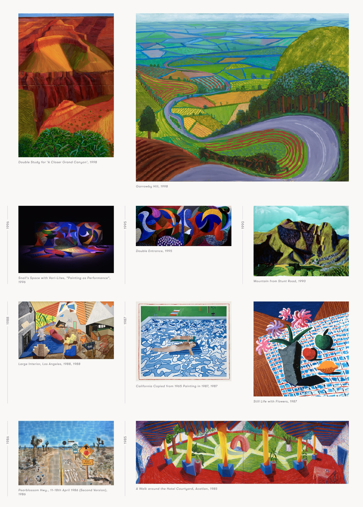

Portland development studio Cast Iron Coding and Surface Streets design in LA worked with the David Hockney Foundation to build a new project from the ground up. The site is an evolving, book-like archive of David Hockney's work chronology, and an adaptable gallery of his public collection.
At the time I was the lead front-end at Cast Iron Coding, and handled all of the front-end markup and scripting for the site. I also helped build a content management utility for the editors to create endlessly varied page and image layouts in the chronology section. After the site's release, we adapted the site for a special iPad kiosk version that was part of an exhibit at the Los Angeles County Museum of Art (LACMA).

You can [visit the site here](https://www.thedavidhockneyfoundation.org/).

During senior year of college, my drawing class had an assignment where we copied drawings from notable artists we could find in the library. At the time, I was learning about my own gender and queerness and feeling pretty alone in 2006. I kind of ended up processing my self-understanding and isolation through this class.

David Hockney was one of the first and only outwardly queer artists I found in my library dive, and I felt some ownership and encouragement learning from his work in that time. I had nothing to do with securing the David Hockney project at Cast Iron, but I felt a personal connection to working on it.

The David Hockney Foundation chronology holds 67 chapters (and growing). One for each year of David Hockney's art career, and a couple of chapters from before that. Hilary Vlastelica at Surface Streets designed template examples with unpredictable and asymmetrical image placements. Geometric and artistic, but not at all fitting into a grid. I loved that the design looked hand-crafted, laid out to respond to and complement the images and text like a magazine. This is still pretty rare on the internet! ...because it's pretty hard to program 😅

 Screenshot from the [2008 chronology](https://www.thedavidhockneyfoundation.org/chronology/2008).

While we were implemeting the website, I stumbled on a [super old video of David Hockney](https://www.youtube.com/watch?v=b-JpI4egl2o) trying a "paintbox:" one of the first digital drawing tools that was used for making television graphics like title cards or weather reports. In my mind, artists who drew using digital tools and "traditional artsists" were different breeds, with different skills and goals. In the video, David Hockney at 11 years older than I am now, sits down and draws for 8 hours on a machine he'd never seen before, immediately taking to it to create captivating and vibrant images. My understanding of visual art changed. An image is an image, and an artist can exercise the fundamentals of shape, light, and color on any medium they choose.

::: punch

:::

Cast Iron had an in-house content layout system created by Peter Sooley called "Contentment" for arranging linear blocks of content on a page. For the custom layouts in the David Hockney chronology, I pitched a redesign for the user interface of contentment that included new columanr layout blocks, that could be used anywhere, including inside other columns. We had started to use React heavily at Cast Iron around this time, so I put together a component for the user to drag-and-drop their content around before sending the new layout to the back-end. Now the David Hockney Foundation staff is able to take Hilary's design inspiration and make creative, original layouts for every year in the chronology with a simple, no-code application.

In the same way that David Hockney has no qualms about jumping between media, he will also create images at any size. Building a searchable collection archive took a lot of collaborative discussions with Hilary about how the design would change and flow depending on the vastly different size ratios of the art that is displayed. I don't remember exactly how we did it, but I think each row of images flows differently depending on the sizes/ratios of the images in that row. It's definitely not perfect, but when you look at it full of images it just kind of works.
