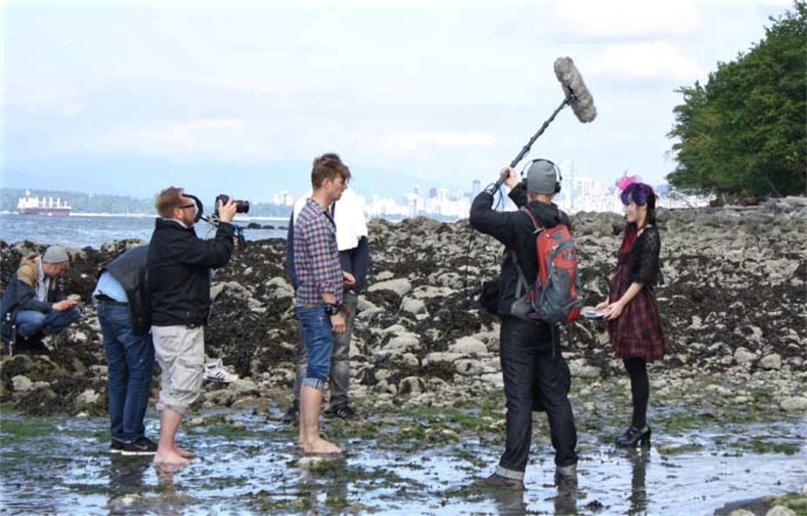
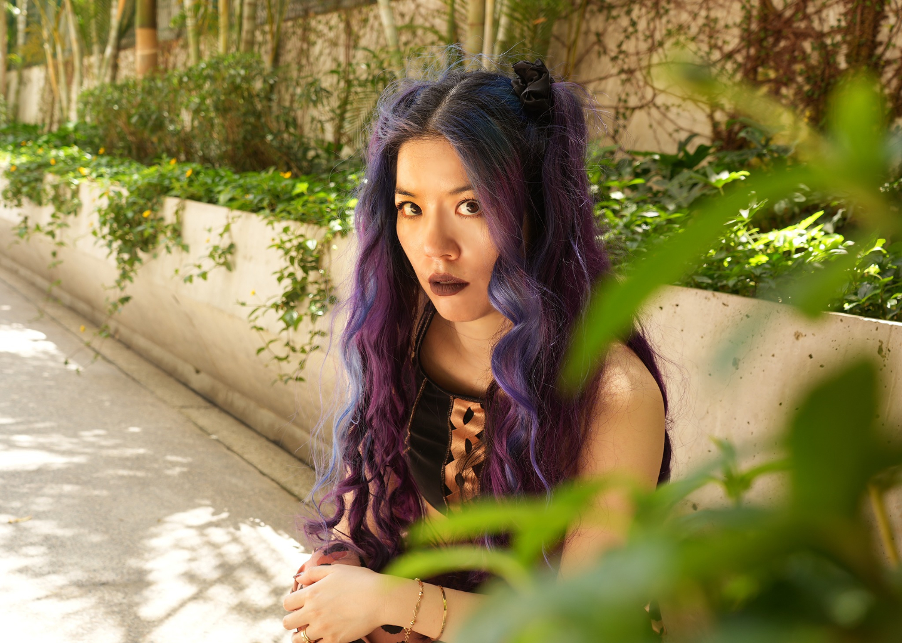
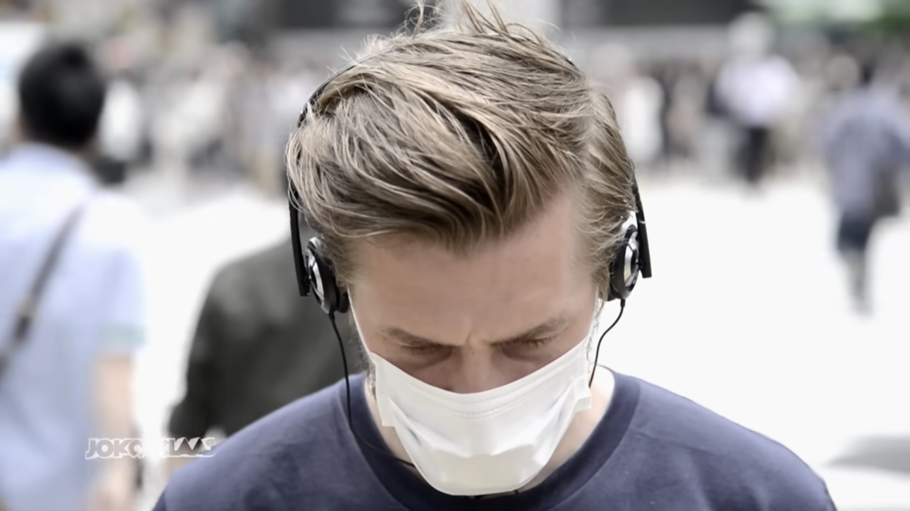
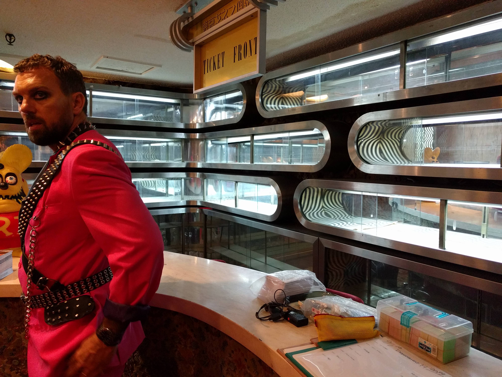
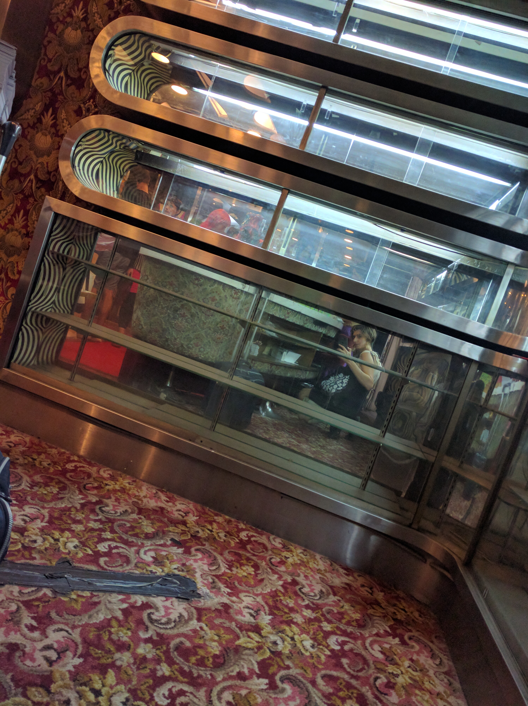

Das Duell Um Die Welt is a travel challenge television show that started in 2012. The show's theme is that the two friends Joko and Klaas keep sending each other (or sometimes other German celebrities as proxies for their team) to do increasingly strange and difficult challenges around the world.

I worked on three episodes of Das Duell Um Die Welt (which is also sometimes called "DUDW," or "Joko Gegen Klaas (Joko vs. Klaas)) with [La Carmina and the Pirates](https://lacarmina.com/pirates/) a film-fixing and production crew, run by the fearless captain (and long-time friend) La Carmina.

This is a long one!! If you don't have time to read about each episode, the short version is that La Carmina and myself, with the help of several long-time collaborators, did production, event planning/casting, translation, and location permits for episodes about Japanese subculture and body-modification. La Carmina hosted extensively on two of the segments, and I even appeared in a couple of spots 😊. The producers told us that these segments ended up being anchors for the show, and have ended up on title cards for recap and trailer videos of the series.

All of the segments that we made for Das Duell Um Die Welt were based on the singular travel culture journalism that La Carmina has been making since the early days of blogging. A brave, goth-hearted adventuer who has been a first hand participant and organizer in many of Japan's hidden subcultures for years. While most people would still be processing what they just saw at an event, she is tirelessly collecting her most interesting tales (and photographs) to share with the world.
I'll write more about La Carmina in other project pages.

Florida TV (the production company behind Joko Vs. Klaas) came to La Carmina after several travel TV and commercial spots, and have consistently wanted to collaborate on featuring underground culture that La Carmina has written about.

## Japan: Klaas lässt sich Donut in die Stirn spritzen _Japan: Klaas has Donut Injected Into His Forehead_

Our first "challenge" from DUDW occurred when Joko sent Klaas to an underground party in Tokyo where he experienced saline inflation in his head that was then pressed into look like a donut or a bagel.

La Carmina was one of the first people to [report on this rare body-modifcation](https://www.lacarmina.com/pirates/bagelheads.php) when it was done at one or two queer-run fetish scene parties in Japan. And Florida wanted Klaas to take it on.
_To be clear, these saline inflations only happened a few times, and were really uncommon!! Not a trend, as has been reported on some sites._

(https://www.youtube.com/watch?v=oQOZOOZtk4A)

For this segment, we essentially arranged for this event to happen. Our long-time collaborator [Keroppy Maeda](https://www.instagram.com/keroppymaeda/) (\* Posts may be NSFW and have really intense body mod stuff!) who was part of the original "bagel-head" events assembled a crew of experienced body modders who were comfortable doing the procedure, and we had our friend Mistress Maya - a shibari performer - tie Klaas up for fun.

We did all of the local arrangements, locations, and translation between crew and Japan staff, some of which is depicted humorously in the show.

**Maybe a screencap from party scene?**

For this particular shoot, La Carmina was on a job in another country so I was the one on camera, guiding Klaas to his strange fate! Despite growing up around TV stuff, this absolutely isn't my expertise. Folks like Klaas and La Carmina make it look easy, but it's not. You can see in the video that I'm much more comfortable when I switch into Japanese translation mode and am not thinking about the camera so much 💕

**Another ultra wide with Joko and La Carmina**

## Kanada: Jokos Mund wird zugenäht

_Canada: Joko's Mouth is Sewn Shut_

https://www.dailymotion.com/video/x18koog

As a "revenge" for the saline experience, Klaas sent Joko to beautiful Vancouver Canada, where he experienced an idyllic tour of the beaches and city views, courtesy of La Carmina. Again, our boy gets lured into an eerie back-channel of society where we introduce him to [Russ Foxx](https://www.russfoxx.com/) (\* Site contains images of intense body mod stuff!), a Vancouver resident and body modification artist who is pushing serious boundaries with techniques like subdermal implants and ear-pointing.

**Something else from that segment, maybe spoilered**

At the end of the day, we brought Joko to a spooky special event that La Carmina hosted to show off Joko's brave change. So, off-camera Russ offered to numb Joko's lips for the procedure, which is something most body modfication folks wouldn't do, and Joko said "no!" He went for the full-pain of multiple sutures through the mouth and worked with his mouth sewn shut for like a few hours! The show poked a lot of fun (no pun intended) but I think this was a very intense challenge for Joko.

Since the Canada segment was in English, I wasn't as involved in the behind-the-scenes production. I still worked on location setup, and designed a poster for the spooky event that flashes by ominously during the show. I'm really grateful I got to visit with La Carmina in Vancouver on this one. Our time together influenced a couple of paintings I did later.

**Ultra wide from Steven performance maybe?**

## Japan: ein Metal-Schlager-Lied performen

_Japan: Perform a Hit Metal Song_

As of 2018, Joko and Klaas have started sending other German celebrities on travel-challenges as part of a new team battle. La Carmina and I worked on the first episode of this new chapter of their show: "Team Joko Gegen Team Klaas (Team Joko Vs. Team Klaas)" with Steven Gätjen, a TV Host and broadcaster who is well known in Germany.

Steven's episode was especially cinematic. The challenge this time was focused on bravery and performance. And, to be honest, La Carmina and my abilities to arrange a fully-casted musical stage act and several on-location events.

Currently, this episode can be viewed in full [on Facebook here](https://www.facebook.com/jokoundklaas/videos/steven-g%C3%A4tjen-metal-schlagerstar-in-tokio/642071992960901/). La Carmina also has [clips and a full article about the episode](https://lacarmina.com/blog/2018/11/weird-japan-travel-tv-show-host-steven-gatjen/) (\* Note this show is pretty NSFW by American TV standards!).

The segment begins in a traditional Japanese house (called a 古民家 "kominka" in Japanese) where Steven is served tea by four people in traditional dress before learning about his mission. This entire scene and location was planned and cast by La Carmina and I as part of a last minute request, and I think we had maybe 48 hours to do it? We were saved by Ryuichi Ichinokawa, who we had previously collaborated with on [another show about Japanese "rent-a-family-member" businesses](https://lacarmina.com/blog/2014/02/host-boys-clubs-shinjuku-hostess-cafes/).

La Carmina was Steven's on-camera guide to his challenge in Tokyo: To perform a song on stage from a mashup of German musical styles - [pop schlager](https://en.wikipedia.org/wiki/Schlager_music) and industrial metal. She introduces Steven to five Japanese performers, two are wearing custom kaiju monster suits, who agreed to be part of the cast.

::: punch @class[punch-lp]

:::

At the end, we had Steven perform on stage at a massive, real fetish and cosplay party run by drag queens each month in Tokyo. For this portion of the show alone we had to work with the event organizers for filming permissions and camera setup, and also figure out how to rent an entire setup of musical instruments for the band to play on camera.

This episode was incredibly stressful and involved a lot of tears.
Still, looking back I'm full of a weird pride that we made it all work. Everyone at Florida TV was wildly creative, sometimes to a frustrating degree, but also kind and understanding to the people who we filmed. This is not an everyday combination for TV. I hope it comes out in the production.
