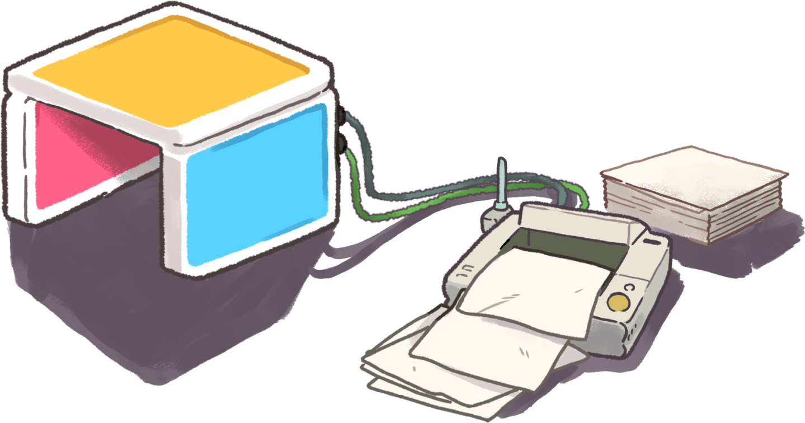

After working on "Cardsmithy" and finishing "No Gloop, No Glory" with Logan, I took some time to look at my values and see what kind of jobs I could do to help organizations or causes that matter to me, especially here in Oregon. Scared of sending lots of resumes off into the void, I instead messaged a bunch of friends I admire to ask if they would meet up to share their advice (and got busy working on this website). Most of these conversations were a very helpful starting point in my search. My friend Kip had something I could do right away!

Recently (I'm writing in Summer 2024), there's been a trend in the legal world to find the next case management software that is always synchronized and easier to on-board for people with different technical backgrounds. I've been a fan of using [Airtable](https://www.airtable.com/) for different software and web-development experiments since they first launched. This happens to be one of the applications that they're trying at the Federal Public Defender here in Oregon.

I've been working with the paralegal team on a Node JS based export tool for their Airtable cases. I can't share anything technical beyond that!

Most of my career has been focused on making things, or helping other people produce things like software or websites. I often worry that this won't be a suitable skill-set to contribute to the things that matter to me this world: resources for marginalized people, queer rights, immigration, prison abolition. I'm willing and excited to learn new things, of course, and I am on this project!
In this case though, something I know how to do is a solution for something very meaningful to me. I'm grateful to have that chance.
