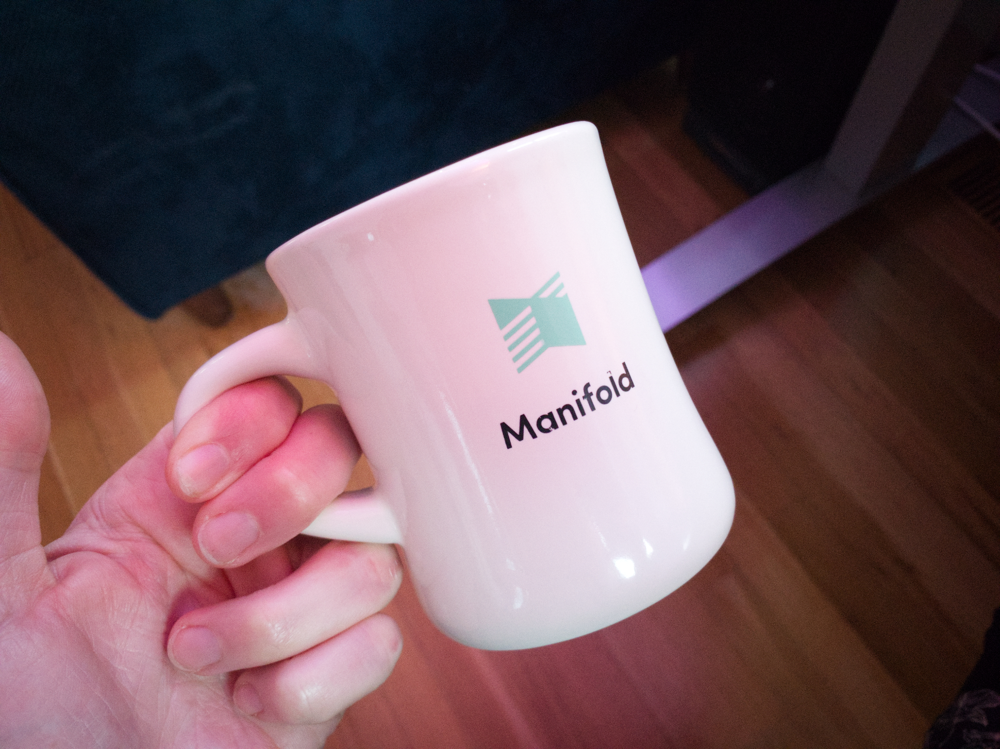

Manifold is a scalable, open-source web application that adds the web to a book publisher's workflow and distribution options. Imagine an academic publishing house with a large and evolving library of texts that are all primarily available in print. Manifold can be their online open-access library, their center of collaboration and editing, or even a way to publish a new kind of digital book with expanded media resources. Manifold is still being actively used and maintained - [you can learn more about it here](http://www.manifoldapp.org)!

Manifold is being used all over the world by publishers like [Athabasca University Press](https://www.aupress.ca/), the [University of Luxembourg](https://www.melusinapress.lu/), and the [University of Minnesota](https://manifold.umn.edu/). Check out any of these pages - they are all built with Manifold! Every curated collection, book, and journal is assembled and made readable on any digital device with all of the flexiblity and power of a website. Oh yeah!

I worked on Manifold on the team at [Cast Iron](https://castironcoding.com/) as a front-end developer from its original version through 2018. Cast Iron CEO Zach Davis took the helm to setup an isomorphic React application for Manifold's UI, and I implemented many of the project's core components and interactions from designs created by Lael Tyler.

Manifold books open in a flexible digital book reader. These texts may have print analogs, but in Manifold, they can contain attached media "resources," links, interactive notes, and annotations.

The reader itself can also be customized while someone is reading. We built an appearance menu that can change the color scheme, font, and text size at any time, without losing your place in the book. When I saw Lael's design for this, I couldn't wait to build this utility because it makes the application feel so much more like an interactive utility. I still have fun playing with it whenever I go to a Manifold page.

::: punch

:::

Publishers can use Manifold to share and publish books at any stage in production, and use them for discussion and iterating on a manuscript. One big feature Zach knew we'd need to build was to let a user highlight and comment on any document, at any word, sentence, or paragraph that they want, just like Google Docs or Medium. This kind of highlighting functionality gets into a lot of low-level details, and I remember it being a very tough challenge with a lot of errors and testing.

Media resources can go anywhere within a Manifold text like a side-note the user can click on. Publishers can also add media resources of any kind to a project and build resource collections within the project -- as many as they want! In programming we often say "don't reinvent the wheel" when someone is designing or coding a media slide-show. There are many examples and code libraries to do this. Manifold collections are different: they can contain nearly any kind of media, and all of its metadata. Collections will have file downloads and links alongside audio recordings, pictures, and videos. It was worth it to have Lael carefully design how each media appears, and develop this ourselves. And hey!

Manifold is [Open Source](https://en.wikipedia.org/wiki/Open_source). You can look at the code [right now](https://github.com/ManifoldScholar/manifold)! Anyone can install and run their own instance for free.

One of the reasons I became interested in programming is because I was inspired by the idea of creating software that anyone could freely access and use. We aren't in a world where anyone can just make free software without compensation. I still think it's worth striving to make software open, and I felt really grateful to be able to work on such a large scale open project like Manifold.

There was also a mug! It's weird to say this after talking about the value of open source, but it's complicated! I was really excited that a program I worked on - and am proud of - had logo mugs.
