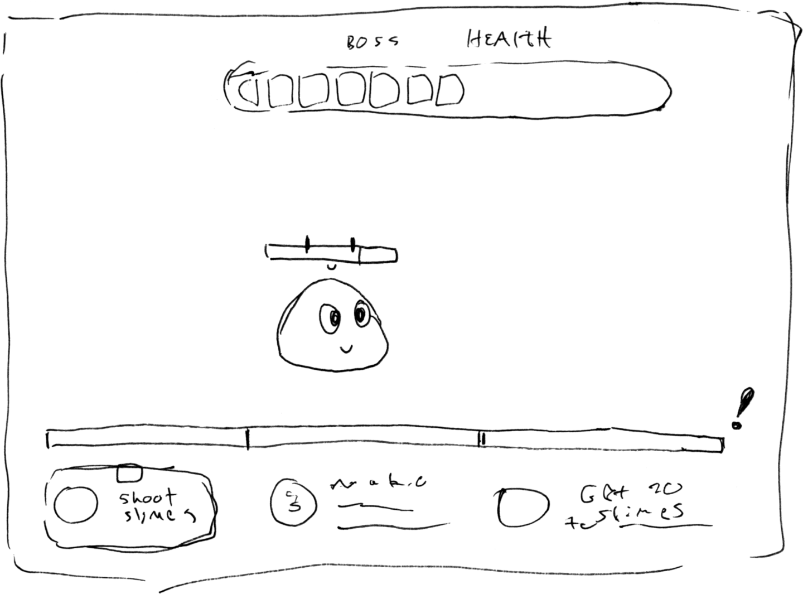
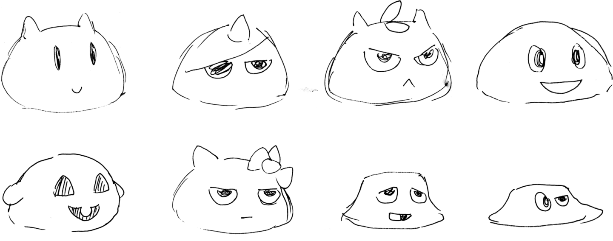
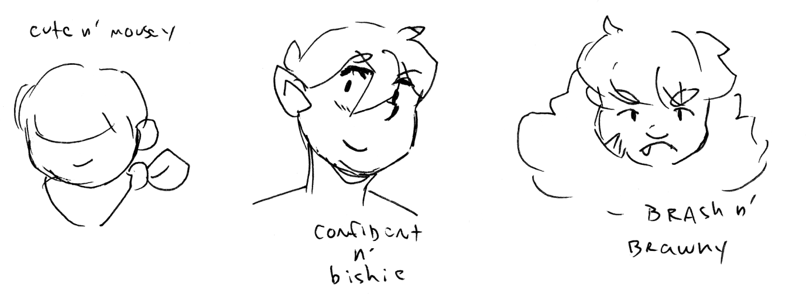

After the company behind [Cardsmithy](/projects/cardsmithy/) closed, the programmer Logan and I had a little bit of time off before starting to look for a next job. We both felt like were still in the swing of working and wanted to make a game that we could finish! I had also _just_ started creating 3D models for Cardsmithy, and really wanted to keep learning and practicing that.

Logan had some experience with Game Jams: short-term events where a team (usually a small one) makes a game in a limited amount of time. He invited me to join a couple of his friends to participate in Ludum Dare (latin for "give a game"): a long running 3 day game making challenge. We did it! We made a short, 3D action game in just 3 days. You can play it [right here](https://prakkus.itch.io/no-gloop-no-glory). I did all of the character design, character modeling, and animations. In the 11th hour, I drew a quick user interface too 😅

Before the event's theme was unveiled, we had done a little brain storming session to come up with a bunch of ideas that we could potentially use if they fit the games theme. One concept that stuck with us was a game where you played as a hoard of slime creatures that would typically be enemies in a fantasy RPG, and fight against a mean hero who has stormed into your dwelling on a quest of some kind.

## Limited Space

Each Ludum Dare has a list of potential themes that people vote on before the jam begins. This time, the theme that got picked was "Limited Space." It could be interpreted in a lot of ways!
After another brain storming session, we were still interested in hanging out with our slimes, but with some modifications to the concept. Instead of playing as a hoard of little slimes, the player would start as a small slime who could slurp up other small slimes to grow big, gain health-power, and obtain new skills to help them beat the hero. As the player grows, however, the space around them constrains their movement more and more.

<video class="content-video medium" width="500" height="500" autoplay loop muted>
  <source 
    src="animation-slime-walk.mov" 
    type='video/mp4; codecs="hvc1"'>
  <source 
    src="animation-slime-walk.webm" 
    type="video/webm">
</video>

We came to a title really early on, and images of the game started falling into place in my mind after that.
Speed is the game for most game-jams, so I worked faster and accepted ideas more quickly than I am used to for a visual project.

Modeling the slime was pretty easy. I remember Logan helping me pay special attention to curving their body so that the player knows what direction they are facing.
I could visualize how I wanted the slime to move in 2D, but 3D characters usually move based on invisible "bones," which were confusing to map onto our slime. Where... do the slimes... bones live? Do they just have one big body bone, or maybe some kind of face bone? It took a lot of trial and error, but eventually I got them to sludge forward with a little bit of tail motion lagging behind.

<video class="content-video" width="1440" height="700" autoplay loop muted>
  <source src="animation-slime-proj.mov" type='video/mp4'>
</video>

The slime's first skill has them tossing a little slime slice out at the hero - trading a bit of health for a projectile weapon. Whern the slime does this I wanted them to squish down into themself, making a little UFO or hat shape with their body. None of the bones that I created could do this 😥 So I ended up learning to use shape keys. Shape keys are different transformations of the same mesh that you can save and animate in and out of. I think they're used a lot for complex, organic movemeants like mouth shpaes. This ended up being the right call, and the squish looked extra slimey. In hindsight, it might have been more organic looking to do all of the slime's animations with shape keys, but there's no time to go back and re-do anything like that in a game jam!

At this point the game was playable, but we didn't have a model or any moves for our hero enemy character. I think we had about a day and a half left and we weren't 100% sure if I could create and animate the hero in time. Creating a human character was one of the things I was most looking forward to about this project - I imagined a simple, low poly warrior like one of the characters in the original Final Fantasy VII. Ahh, being able to create characters like that felt like part of a childhood dream. I didn't want to give up, yet.

Settling on a design for Glory took a while - I'm still getting used to just saying "OK!" and moving on under a such a short deadline. I spent a lot of time trying out different hairstyles, since this is so important to identifying simplified anime/chibi style characters.
I modeled them as quickly as I could, and built a color map for them using a color pallete technique from the game developer [Imphenzia](https://imphenzia.com/). I think I wanted to wait to model the hair until we were further along, but we never ended up getting that time. So, another lesson learned 💖.

<video class="content-video" width="1440" height="700" autoplay loop muted>
  <source src="animation-glory-walk.mov" type='video/mp4'>
</video>

I remember another crossroads when I finished modeling Glory. We weren't sure if I had time left to completely rig and animate the character, but Logan had faith in me again. This, at least, was something I had done before, so I was able to get their walking animation together fairly quickly. I remember doing a lot of the modeling and animating work on a stream. Having the team there for feedback kept me motivated, and I was less likely to get distracted with everyone there.
We added details like a torso turn to lend realism to Glory's walk. At this point, seeing the character I created lumbering towards our slime in game was really moving. I felt like, in such a short time, we were closing in on a finished game!

The gameplay ended up being a little bit clunky and pretty difficult. We had a smidge of time to do some adjustments, and that was it for the Game Jam. At this time, we realized that we put so much effort into filling out the game's characters and animations that we didn't have quite as much time to playtest and iterate as we wanted. This is a good lesson too, but at the same time, we all got to dive into what we wanted to learn, so in that way it was very much a success.

Seeing this game completed in a short time profoundly changed my perspective on creativity. I had been struggling for years with the idea that I was not a "good enough" creator, and that I couldn't make the things I dreamed or thought about. But after the Game Jam I understood that I can, if I want. It's just a question of time, scope, and setting realistic goals where you learn to be OK with things as imperfect and move on.
